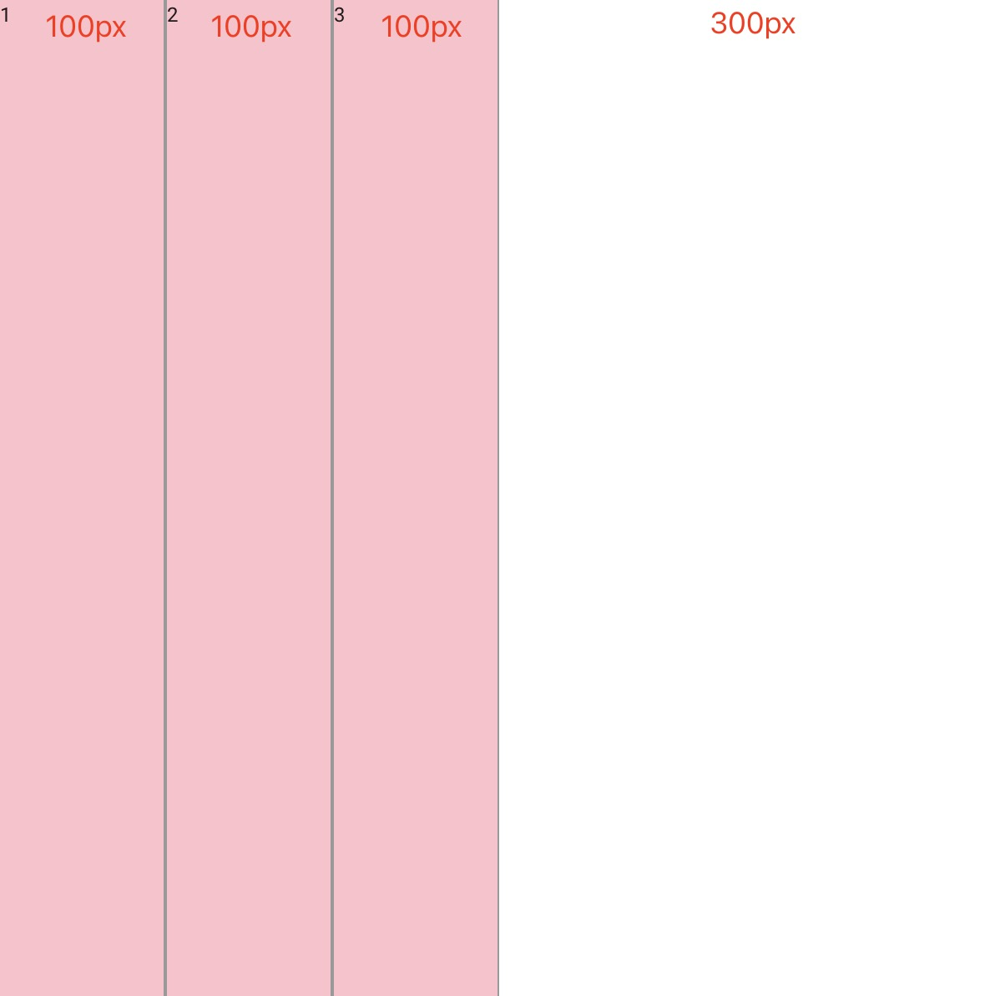
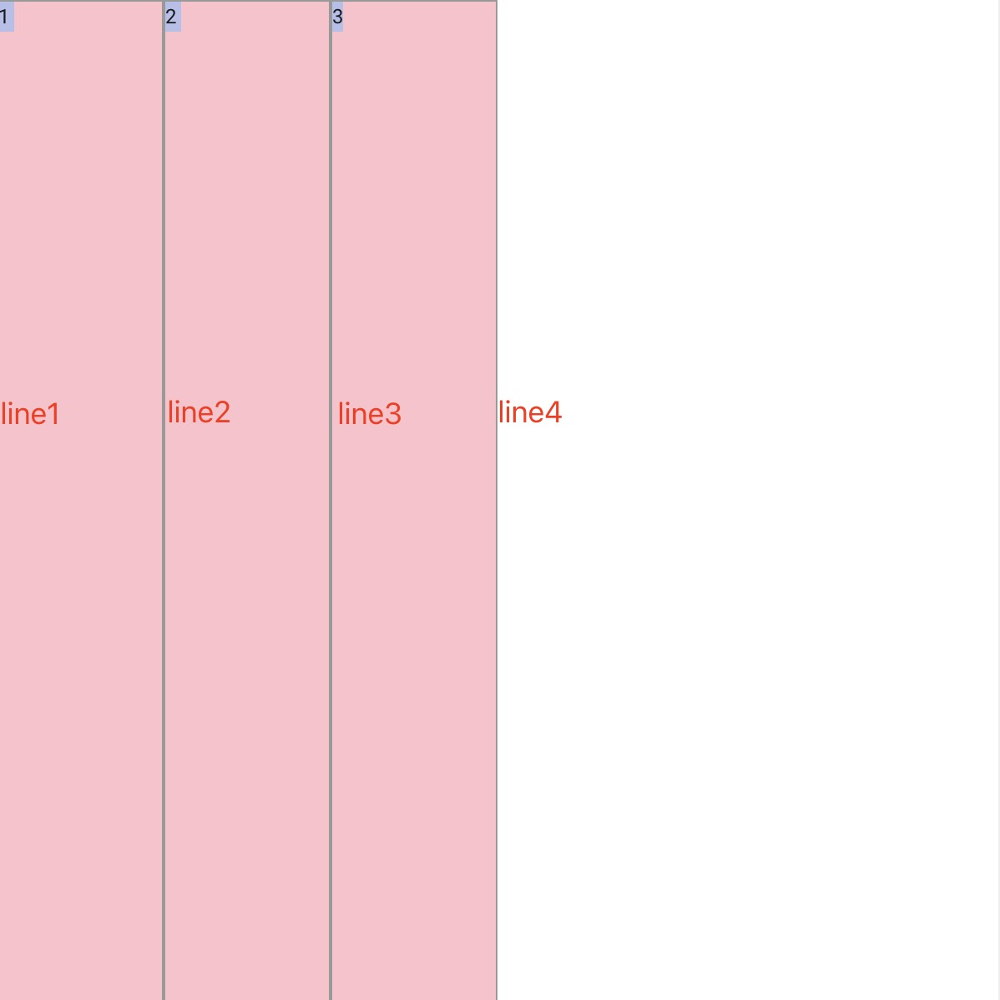
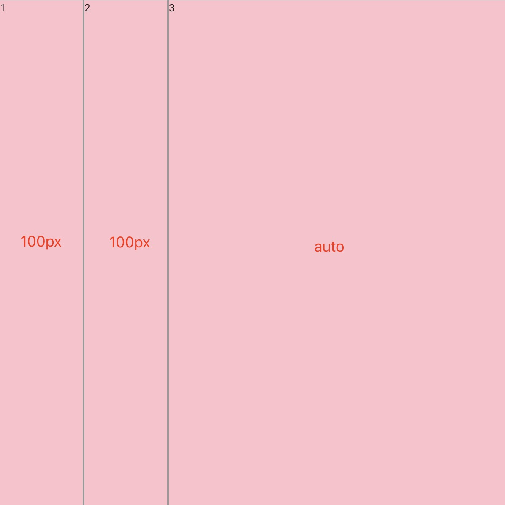
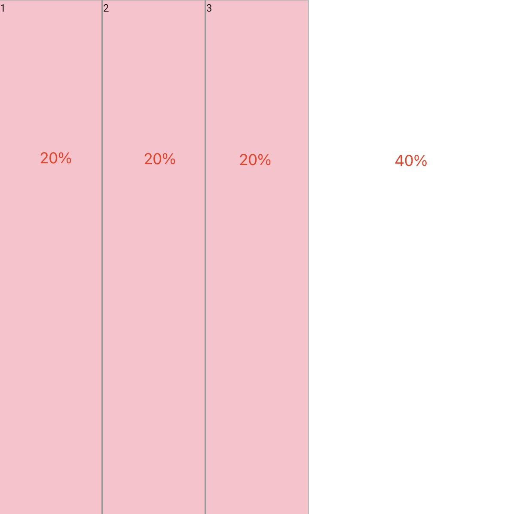
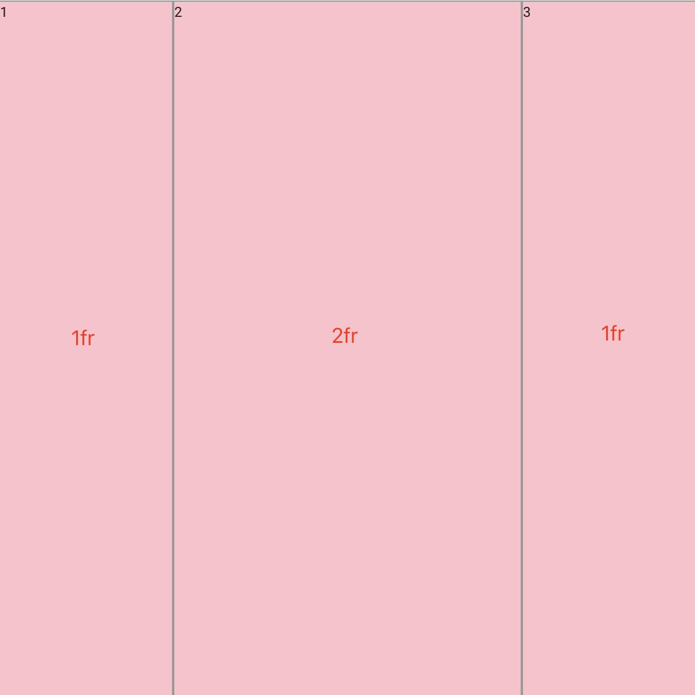
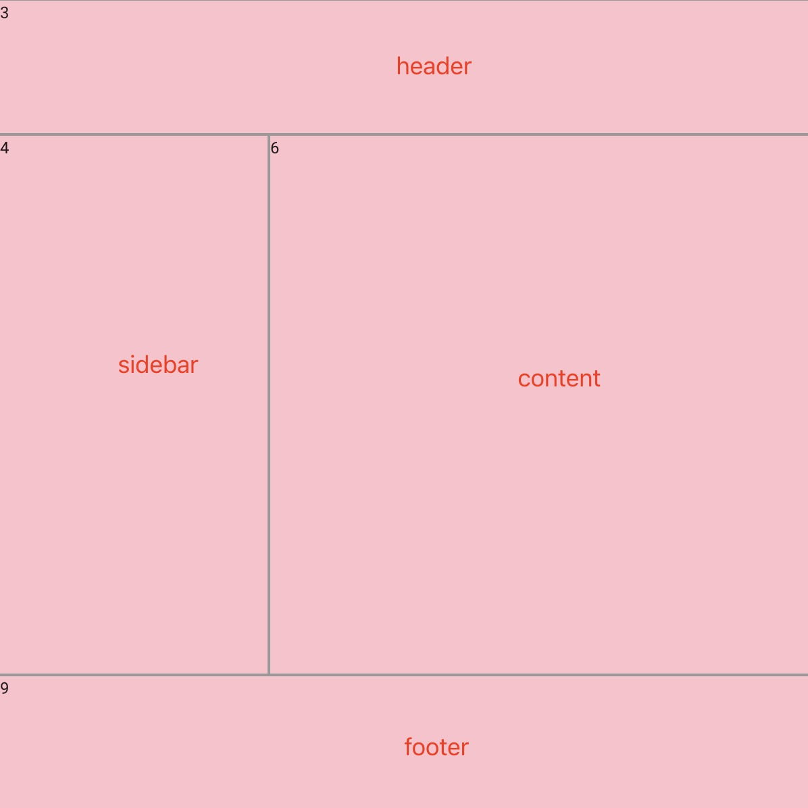
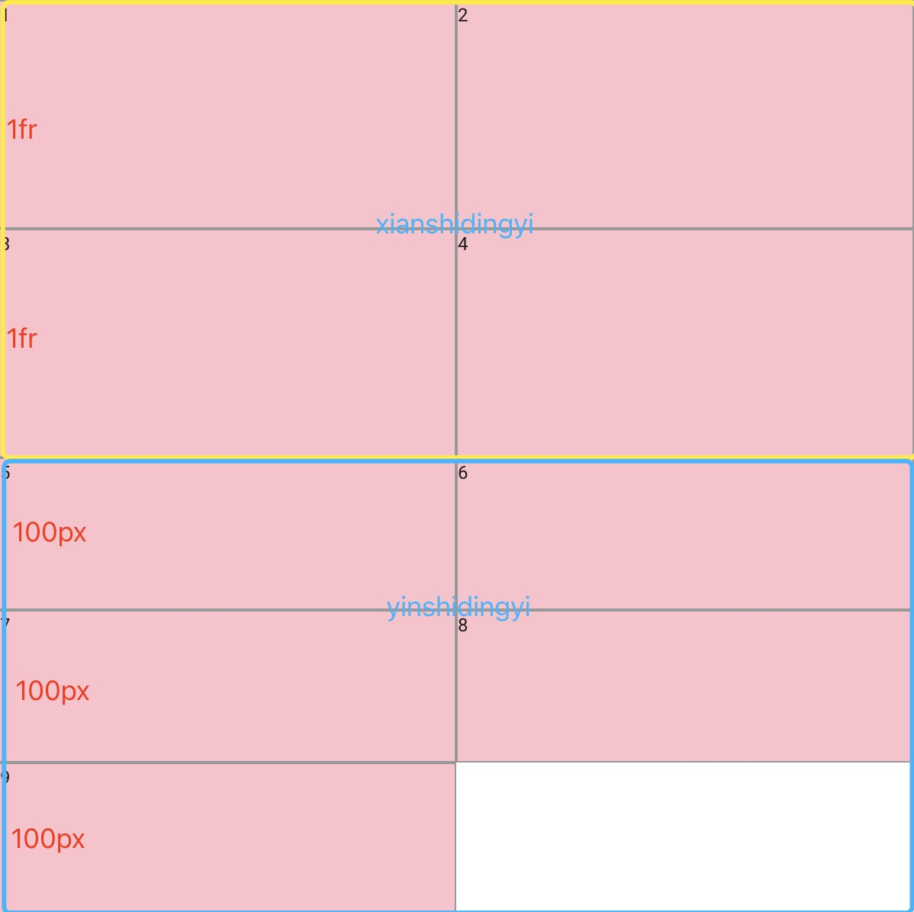
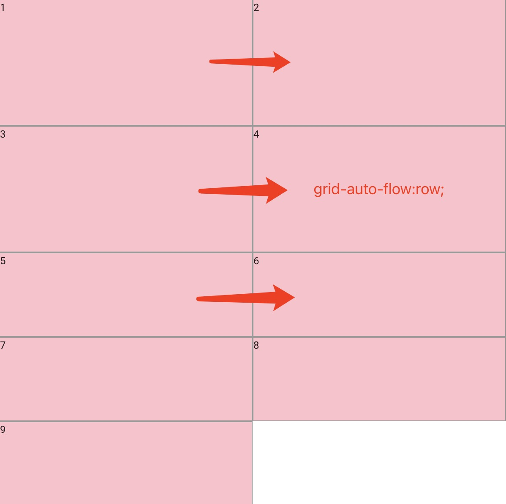
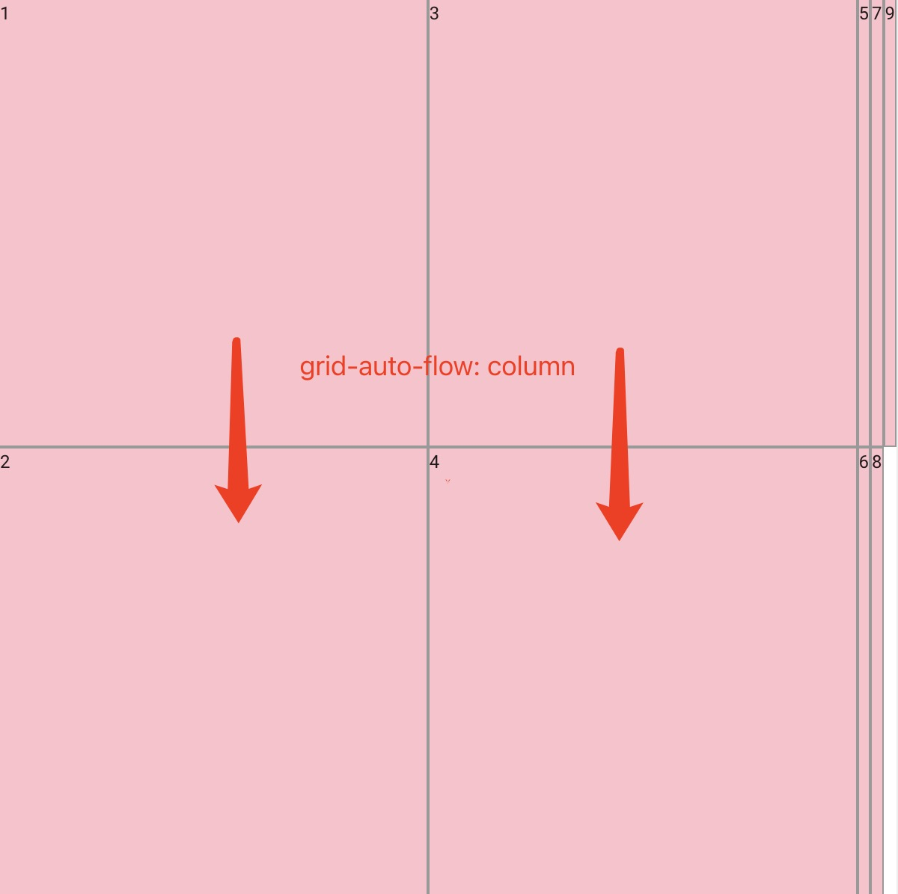
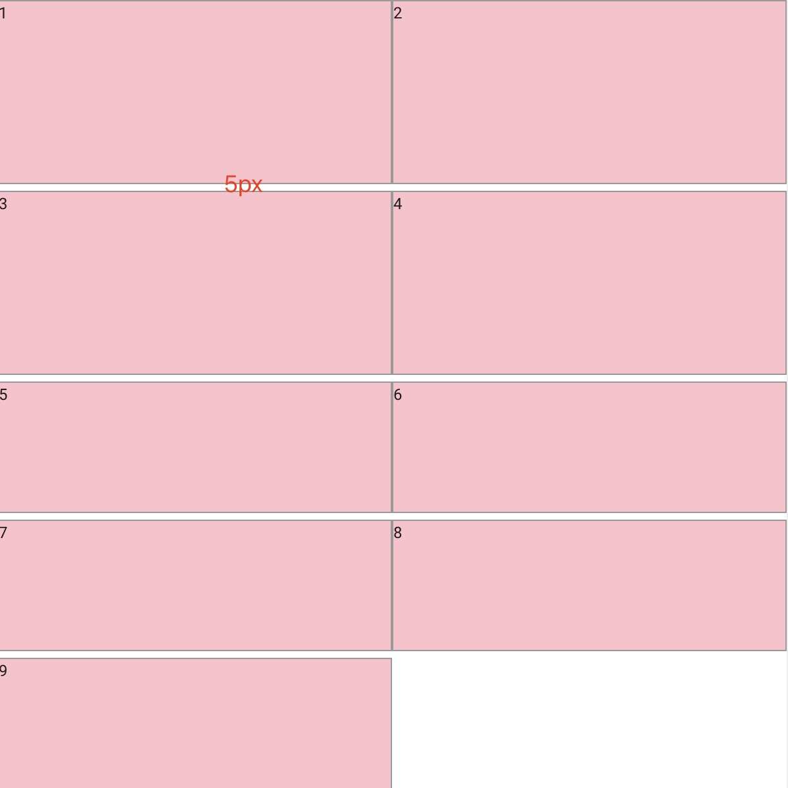

### 简介
相较于flex的一维的弹性布局，那么grid就可以说是二维的弹性布局了，所以grid拥有flex布局特点，而且较之更强大
### 概念
- **网格容器**
  
  display属性为grid的html元素，它是所有网格项的直接父元素
- **网格项**
  
  网格容器的直接子元素
- **网格轨道**

  两条行网格线或两条列网格线之间的部分
- **网格线**
  用于辅助描述网格结构的虚拟线，在实际web页面中并不存在
- **网格区域**
  有多个相同区域名称的网格单元组成的布局空间

### 创建一个网格不局容器
```css
.container{
    display: grid;
}
```
### 网格容器属性

1. **grid-template-columns**
   
   定义列网格线的名称和网格轨道上的网格项的尺寸大小

###### 定义一个拥有三列，且每列的宽度为100px的网格布局
```css
.container{
    display:grid;
    width: 600px;
    height: 600px;
    grid-template-columns:100px 100px 100px;
}
```


###### 定义一个带有网格线名称的布局
```css
.container{
    display:grid;
    width: 600px;
    height: 600px;
    grid-template-columns:[line1] 100px [line2] 100px [line3] 100px [line4];
}
```


###### 定义一个第一列和第二列宽度为100px,第三列自动填充的网格布局
```css
.container{
    display:grid;
    width: 600px;
    height: 600px;
    grid-template-columns:100px 100px auto;
}
```


###### 定义一个拥有三列，且每列的宽度为20%的网格布局
```css
.container{
    display:grid;
    width: 600px;
    height: 600px;
    grid-template-columns:20% 20% 20%;
}
```

###### 定义一个第一列1等份，第二列2等份，第三列1等份的网格布局
```css
.container{
    display:grid;
    width: 600px;
    height: 600px;
    grid-template-columns:1fr 2fr 1fr;
}
```


2. **grid-template-rows**
   定义行网格线的名称和网格轨道上的网格项的尺寸大小，和列网格相对应
3. **grid-template-area**
   用于定义网格区域的布局
###### 定义一个具有header,sidebar,content,footer的布局
```css
.header{
  grid-area: header;
}
.sidebar{
  grid-area: sidebar;
}
.content{
  grid-area: content;
}
.footer{
  grid-area: footer;
}
.container{
    display:grid;
    width: 600px;
    height: 600px;
    grid-template-rows:1fr 1fr 1fr;
    grid-template-columns:100px 1fr 100px;
    grid-template-areas: 
    'header header header'
    'sidebar content content'
    'footer footer footer';
}
```

4. **grid-template**
   grid-template-rows,grid-template-columns和grid-template-areas的简写

```css
.container{
    display:grid;
    width: 600px;
    height: 600px;
    grid-template-rows:1fr 1fr 1fr;
    grid-template-columns:100px 1fr 100px;
    grid-template-areas: 
    'header header header'
    'sidebar content content'
    'footer footer footer';
}
// 简写形式
.container{
    display:grid;
    width: 600px;
    height: 600px;
    grid-template:
    'header header header' 1fr 
    'sidebar content content' 1fr
    'footer footer footer' 1fr/1fr 1fr 1fr;
}
```

5. **grid-auto-rows**
   
用于指定隐式创建的行轨道大小。
###### 定义两列，两行的显示网格布局和两列两行的隐式布局，隐式布局行宽为100px

```css
.container{
    display:grid;
    width: 600px;
    height: 600px;
    grid-template-rows:1fr 1fr;
    grid-template-columns:1fr 1fr;
    grid-auto-rows:100px 100px;
}
```

6. **grid-auto-columns**
   
用于指定隐式创建的行轨道大小,使用和grid-auto-rows一样

7. **grid-auto-flow**

影响网格项的布局方式，row 是横行布局，column是纵向布局

```css
.container{
  display:grid;
  width: 600px;
  height: 600px;
  grid-template-rows: 1fr 1fr;
  grid-template-columns: 1fr 1fr;
  grid-auto-rows: 100px;
  grid-auto-flow: row;
}
```

```css
.container{
  display:grid;
  width: 600px;
  height: 600px;
  grid-template-rows: 1fr 1fr;
  grid-template-columns: 1fr 1fr;
  grid-auto-rows: 100px;
  grid-auto-flow: column;
}
```


8. **grid-row-gap/row-gap**

行间隔
```css
.container{
  display:grid;
  width: 600px;
  height: 600px;
  grid-template-rows: 1fr 1fr;
  grid-template-columns: 1fr 1fr;
  grid-auto-rows: 100px;
  row-gap:5px;
}
```


9. **grid-column-gap/column-gap**

列间隔

10. **grid-gap/gap**

行间隔和列间隔的简写

gap: value

gap: row-gap column-gap

### 网格容器属性值

1. \<length\>
用于表示距离尺寸，常用的有px,rem,pt等
2. \<percentage\>
百分比距离尺寸，比如20%
3. \<flex\> 弹性因子，比如 1fr
4. max-content 是一个用来表示以网格项的最大的内容来占据网格轨道的关键字。
5. min-content 是一个用来表示以网格项的最大的最小内容来占据网格轨道的关键字。
6. minmax(min, max) 设置最大值和最小值
7. repeat 表示网格轨道的重复部分，以一种更简洁的方式去表示大量而且重复行的表达式。

### 网格项等属性

1. **grid-area**
  网格项的区域名称
2. 