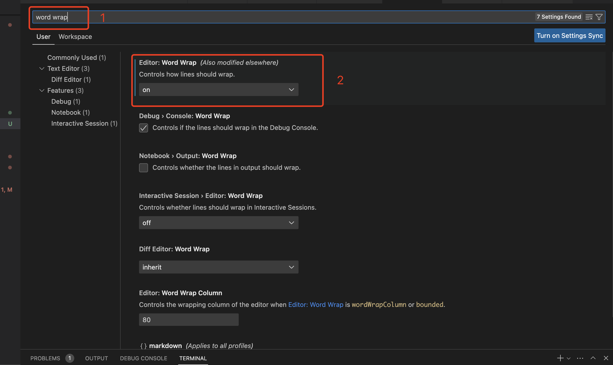

# vscode常用技巧

## 常用快捷键

mac和windows的辅助键对比 [command]->[ctrl],[option]->[alt]
设置界面：[command]+[,]
命令行面板：[command]+[shift]+[P]
快速打开文件：[command]+[P]
查看所有快捷键：[command]+[K]-[command]+[S],
分割编辑器：[command]+[数字]

### 如何开启自动换行

打开【设置】-> 输入word wrap -> 找到 【word wrap】选项开启就可以了

### VSCode Snippets

#### 1.常用的snippets

#### 2.查看当前文件对于语言的所有snippets

1. 通过【command】+【shift】+【P】打开命令面板

### 安装code扩展命令

1. 通过【command】+【shift】+【P】打开命令面板
2. 输入 "Install code command in PATH",打开此命令
3. 在终端即可通过 "code [文件路径] [-a]" 在【vscode】中打开相应文件或文件夹

### 开启调试断点功能

### 开启多终端

### vscode常用插件

- **EditorConfig for VS Code** 使vscode支持.editorconfig配置的插件
- **ESLint** 使vscode支持eslint的插件
- **Prettier - Code formatter** 使vscode支持prettier的插件
- **Markdownlint** markdown格式化工具
- **open in browser** 提供通过右键菜单选择在浏览器中打开当前文件
