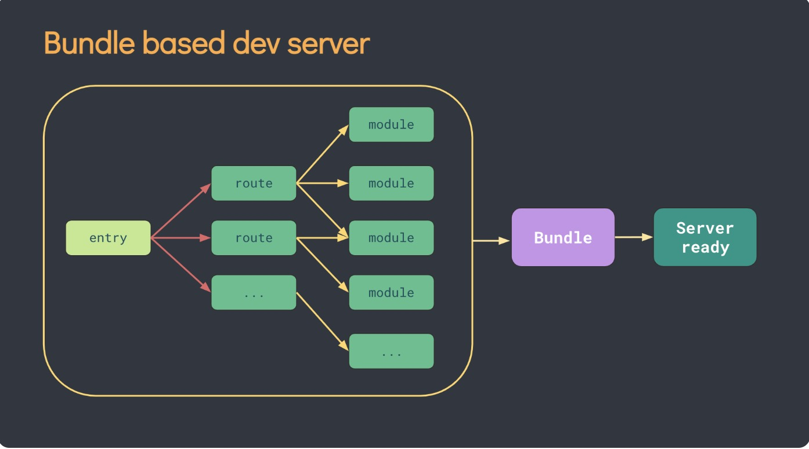
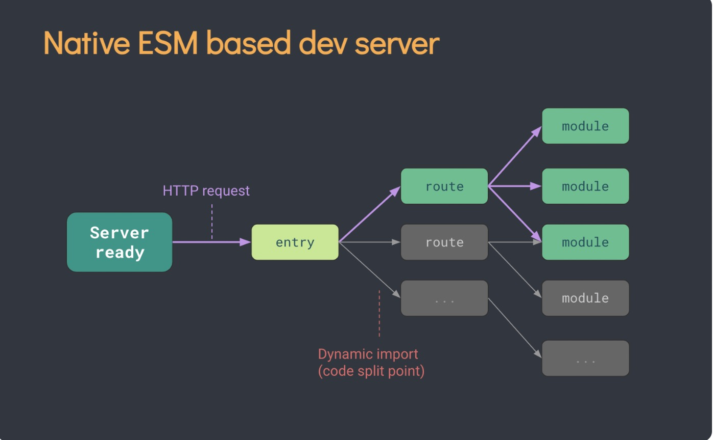

### 1.vue3使用vite做服务，启动更快更高效
    - 极速的服务启动 使用原生 ESM 文件，无需打包!
    - 轻量快速的热重载 无论应用程序大小如何，都始终极快的模块热重载（HMR）
    - 完全类型化的API灵活的 API 和完整 TypeScript 类型。
  
  
### 2.vue3使用rollup.js打包js，速度更快，由于其基于js原生模块机制，也就是基于esm的打包，所以对tree shaking更友好
### 3.vue3原生支持ts，对typescript支持更友好，vue3的模块都有相应的ts申明文件，所有vue3推荐使用ts编写代码
### 4.diff算法优化
### 5.响应式系统升级

### 6.vue3支持片段;也就是说template下可以有多个dom元素，不再要求只有唯一的根节点

### 7.vue3新增setup函数以实现composition API